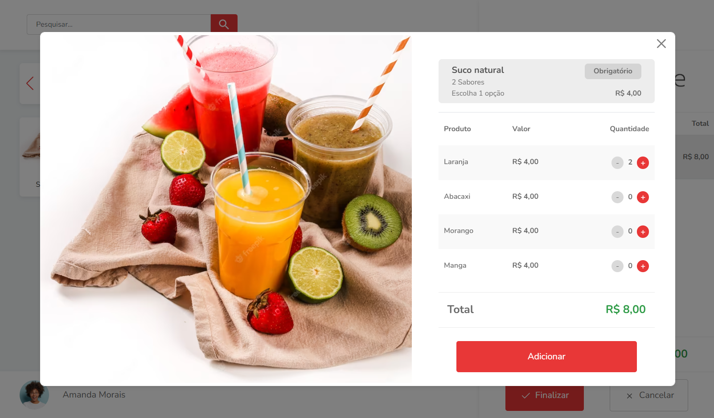
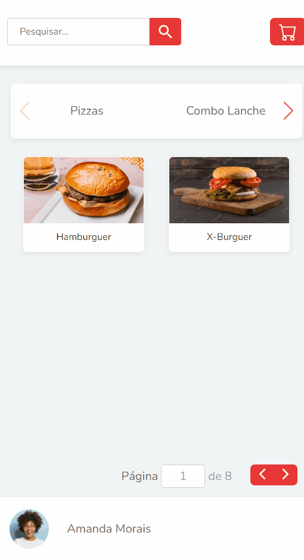

<h1 align="center">Desafio front end</h1>
<h4 align="center">Feito com React.js e Bootstrap</h4>

&#xa0;

**<p align="center">Sumário</p>**

<p align="center">
<a href="#dart-sobre">Sobre</a> &#xa0; | &#xa0;
<a href="#white_check_mark-funcionalidades">Funcionalidades</a> &#xa0; | &#xa0;
<a href="#computer-tecnologias">Tecnologias</a> &#xa0; | &#xa0;
<a href="#hammer_and_wrench-serviços">Serviços</a> &#xa0; | &#xa0;
<a href="#camera-imagens">Imagens</a>
</p>
<p align="center">
<a href="#scroll-rodando-o-projeto">Rodando o projeto</a> &#xa0; | &#xa0;
<a href="#orange_book-como-usar">Como usar</a> &#xa0; | &#xa0;
<a href="#link-links">Links</a> &#xa0; | &#xa0;
<a href="#sparkles-autor">Autor</a>
</p>

&#xa0;

## :dart: Sobre

<p>O objetivo foi desenvolver um projeto seguindo uma lista de requisitos, para participar do processo seletivo de Desenvolvedor Front End na <a href="https://privatecode.com.br/">Private Code</a>.</p>
<p>Se trata de um sistema de delivery, onde o usuário pode visualizar os produtos, adicioná-los no carrinho e concluir o seu pedido.</p>

&#xa0;

## :white_check_mark: Funcionalidades

As principais funcionalidades do projeto são:

✔️ Permitir o usuário separar e listar os produtos por categoria;

✔️ Permitir o usuário realizar pesquisas globais de produtos;

✔️ Adicionar determinado produto ao carrinho;

✔️ Permitir aumentar a quantidade de um produto que já está no carrinho;

✔️ Permitir remover determinado produto do carrinho;

✔️ Calcular em tempo real o valor total do pedido;

✔️ Validar o CEP digitado pelo usuário;

✔️ Preencher os campos de endereço automaticamente de acordo com o CEP digitado;

✔️ Enviar os dados do pedido para a API (json server);

✔️ Réplica do layout disponibilizado no Figma;

✔️ Aplicação responsiva.

&#xa0;

## :computer: Tecnologias

- [HTML](https://developer.mozilla.org/pt-BR/docs/Web/HTML)

- [CSS](https://developer.mozilla.org/pt-BR/docs/Web/CSS)

- [Bootstrap](https://getbootstrap.com/)

- [SASS](https://sass-lang.com/) (Configuração Bootstrap)

- [TypeScript](https://www.typescriptlang.org/)

- [React.js](https://pt-br.reactjs.org/)

- [React Hook Form](https://react-hook-form.com/)

- [Swiper](https://swiperjs.com/)

- [Axios](https://axios-http.com/)

- [Vite](https://vitejs.dev/)

- [JSON server](https://github.com/typicode/json-server)

&#xa0;

## :hammer_and_wrench: Serviços

- <a href="https://github.com/">GitHub</a>

- <a href="https://fonts.google.com/">Google Fonts </a>- importação da fonte

- <a href="https://viacep.com.br/">ViaCEP </a>- API de CEP

&#xa0;

## :camera: Imagens

**<p align="center">Funcionamento do projeto:</p>**

<div align="center">
  
</div>

**<p align="center">Adicionando um produto ao carrinho:</p>**

<div align="center">
  
</div>

**<p align="center">Versão mobile:</p>**

<div align="center">
  
</div>

&#xa0;

## :scroll: Rodando o projeto

É necessário um navegador e um editor de código (recomendado vs code)

```bash
# Clone este repositório
$ git clone https://github.com/CaioAugustoHD/Desafio-front-end

# Acesse a pasta do projeto no terminal/cmd
$ cd Desafio-front-end

# Instale as dependências
$ npm init

# Instale o pacote json-server
$ npm install -g json-server

# Inicie o json-server (a API ficará ativa em http://localhost:3000)
$ npx json-server --watch db.json

# Em um outro terminal, inicie o projeto
$ npm run dev

# O projeto ficará ativo em http://127.0.0.1:5173/
```

⚠️ Sem a API ativa, o projeto não funcionará corretamente!

&#xa0;

## :orange_book: Como usar

<p>Depois de seguir os passos anteriores e a aplicação estiver em execução, chegou a hora de escolher suas comidas favoritas. Você pode pesquisar por determinado produto ou listar por categorias, utilizando a barra de pesquisa e o menu de navegação, respectivamente.</p>
<p>Ao clicar em algum produto, será exibido um modal com o preço e a opcão de adicionar ao carrinho.</p>
<p>No carrinho, todos seus produtos adicionados são exibidos. Você ainda tem a opção de aumentar sua quantidade ou removê-lo. Também é possível visualizar em tempo real o valor total da sua compra.</p>
<p>Para confirmar seu pedido, clique no botão "Finalizar". Será exibido para você um formulário, onde deve preenchê-lo utilizando um <strong>CEP válido</strong>. Caso seja inválido, o formulário acusará um erro e seu pedido não poderá ser realizado. Mas caso ocorra tudo certo, uma mensagem será mostrada, indicando que seu pedido foi realizado.</p>

&#xa0;

## :link: Links

- Repositório: https://github.com/CaioAugustoHD/Desafio-front-end

&#xa0;

## :sparkles: Autor

<h4>Feito por Caio Augusto Pereira</h4>

<a href="https://github.com/CaioAugustoHD">

</a>

&#xa0;

[](https://www.linkedin.com/in/caio-augusto-cap/)<br>
[](mailto:caioaugustosbs@gmail.com)
