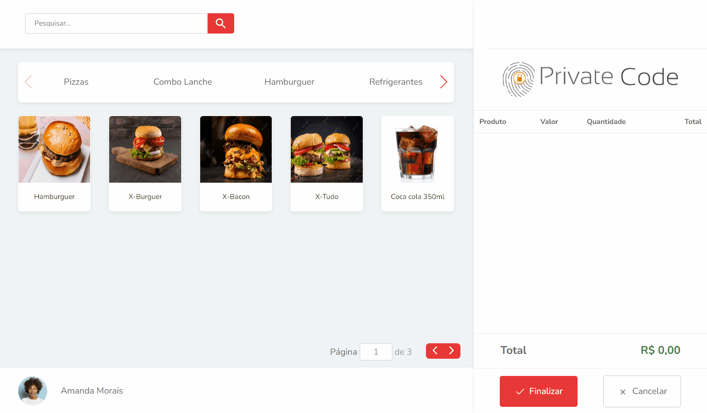

<h1 align="center">Desafio front end</h1>
<h4 align="center">Feito com React.js e Bootstrap</h4>

 &#xa0;

**<p align="center">Sumário</p>**
<p align="center">
<a href="#dart-sobre">Sobre</a> &#xa0; | &#xa0;
<a href="#white_check_mark-funcionalidades">Funcionalidades</a> &#xa0; | &#xa0;
<a href="#computer-tecnologias">Tecnologias</a> &#xa0; | &#xa0;
<a href="#hammer_and_wrench-serviços">Serviços</a>
</p>
<p align="center">
<a href="#camera-imagens">Imagens</a> &#xa0; | &#xa0;
<a href="#scroll-rodando-o-projeto">Rodando o projeto</a> &#xa0; | &#xa0;
<a href="#link-links">Links</a> &#xa0; | &#xa0;
<a href="#sparkles-autor">Autor</a>
</p>

 &#xa0;
 
## :dart: Sobre
<p>O objetivo do projeto foi desenvolver um projeto seguindo uma lista de requisitos, para participar do processo seletivo de Desenvolvedor Front End na <a href="https://privatecode.com.br/">Private Code</a>.</p>
<p>Se trata de um sistema de delivery, onde o usuário pode visualizar os produtos, adicioná-los no carrinho e concluir o seu pedido.</p>


&#xa0;

## :white_check_mark: Funcionalidades
As principais funcionalidades do projeto são:

✔️ Réplica do layout disponibilizado no Figma;

✔️ Permitir o usuário separar e listar os produtos por categoria;

✔️ Permitir o usuário realizar pesquisas globais de produtos;

✔️ Adicionar determinado produto ao carrinho;

✔️ Permitir aumentar a quantidade de um produto que já está no carrinho; 

✔️ Permitir remover determinado produto do carrinho;

✔️ Calcular em tempo real o valor total do pedido;

✔️ Validar o CEP digitado pelo usuário;

✔️ Preencher os campos de endereço automaticamente de acordo com o CEP digitado;

✔️ Enviar os dados do pedido para a API (json server);

✔️ Aplicação responsiva.

&#xa0;

## :computer: Tecnologias
* [HTML](https://developer.mozilla.org/pt-BR/docs/Web/HTML)

* [CSS](https://developer.mozilla.org/pt-BR/docs/Web/CSS)

* [Bootstrap](https://getbootstrap.com/)

* [SASS](https://sass-lang.com/) (Configuração Bootstrap)

* [TypeScript](https://www.typescriptlang.org/)

* [React.js](https://pt-br.reactjs.org/)

* [React Hook Form](https://react-hook-form.com/)

* [Swiper](https://swiperjs.com/)

* [Axios](https://axios-http.com/)

* [Vite](https://vitejs.dev/)

* [JSON server](https://github.com/typicode/json-server)

&#xa0;

## :hammer_and_wrench: Serviços
* <a href="https://github.com/">GitHub</a>

* <a href="https://fonts.google.com/">Google Fonts </a>- importação da fonte


&#xa0;

## :camera: Imagens
**<p align="center">Funcionamento do projeto:</p>**
<div align="center">
  
</div>

**<p align="center"></p>**
<div align="center">
  
</div>


&#xa0;

## :scroll: Rodando o projeto
É necessário um navegador e um editor de código (recomendado vs code)

```bash
# Clone este repositório
$ git clone https://github.com/CaioAugustoHD/Desafio-front-end

# Acesse a pasta do projeto no terminal/cmd
$ cd Desafio-front-end

# Instale as dependências
$ npm init

# Inicie o JSON server (a API ficará ativa em http://localhost:3000)
$ npx json-server --watch db.json

# Inicie o projeto
$ npm run dev

# O projeto ficará ativo em http://127.0.0.1:5173/
```

&#xa0;

## :link: Links
* Repositório: https://github.com/CaioAugustoHD/Desafio-front-end

&#xa0;

## :sparkles: Autor

<h4>Feito por Caio Augusto Pereira</h4>

<a href="https://github.com/CaioAugustoHD">

</a>

&#xa0;

[](https://www.linkedin.com/in/caio-augusto-cap/)<br>
[](mailto:caioaugustosbs@gmail.com)
